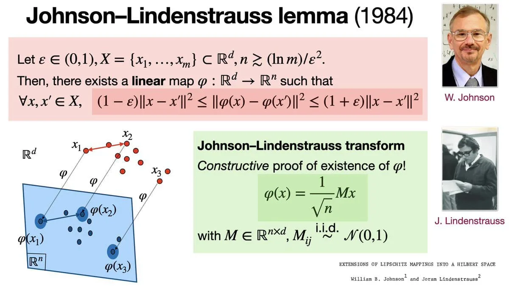
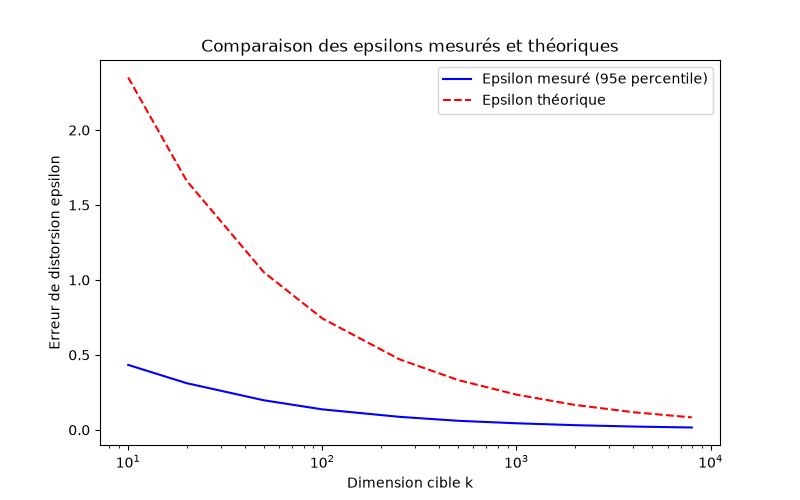
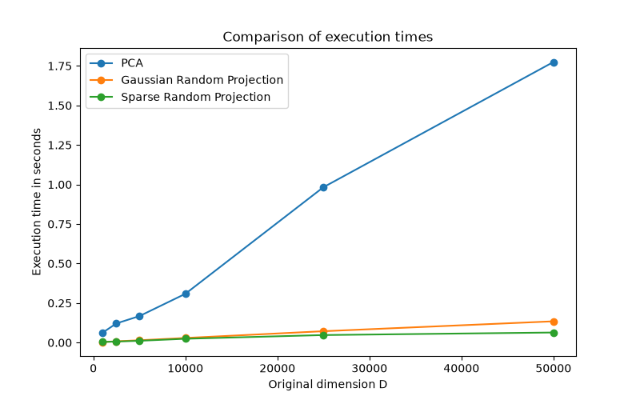

# Empirical validation of the Johnson-Lindenstrauss lemma on text data

## Introduction

I recently came across this fascinating lemma and decided to look further because of it's counter-intuitive nature.

This report presents an empirical evaluation of dimensionality reduction on high-dimensional text data (here, $N=1000$ documents from the `20newsgroups` dataset). By using `scikit-learn` library on Python, we investigate the tradeoff between distance distortion and target dimension $k$, alongside a computational performance comparison between PCA and common random projection techniques (Gaussian and Sparse).

---

## 1. Mathematical framework

The Johnson-Lindenstrauss lemma guarantees that a set of $N$ points in a high-dimensional space $\mathbb{R}^D$ can be mapped into a much lower-dimensional space $\mathbb{R}^k$ while preserving pairwise euclidean distances up to a factor of $1 \pm \epsilon$.

For any $\epsilon \in (0, 1)$ and integer $N$, if the target dimension $k$ satisfies:

$$k \ge \frac{8 \ln(N)}{\epsilon^2}$$

then there exists a linear map $f: \mathbb{R}^D \to \mathbb{R}^k$ such that for all $u, v \in X$:

$$(1 - \epsilon) \Vert{}u - v\Vert{}^2 \le \Vert{}f(u) - f(v)\Vert{}^2 \le (1 + \epsilon) \Vert{}u - v\Vert{}^2$$

In theoretical literature, this bound is often stated using asymptotic notations. 
- The upper bound $O(\log(N)/\epsilon^2)$ proves that a target dimension of this size is always sufficient to preserve distances ([Johnson & Lindenstrauss, 1984](#ref-jl84)). 
- The lower bound $\Omega(\log(N)/\epsilon^2)$ proves that no algorithm can ever compress data into fewer dimensions without exceeding $\epsilon$ ([Larsen & Nelson, 2017](#ref-ln17); [Alon, 2003](#ref-alon03)). 

Together these results demonstrate that this bound is strictly optimal. We will omit the proofs here for brevity.

*With the mathematical foundations established, let's now evaluate these properties on real data.*

---

## 2. Experimental setup

We will evaluate two primary aspects:

- **Experience 1 :** Distance distortion $\epsilon$ across target dimensions $k \in \{10, 20, 50, 100, 250, 500, 1000, 2000, 4000, 8000\}$.
- **Experience 2 :** Execution times across varying vocabulary sizes $D \in \{1000, 2500, 5000, 10000, 25000, 50000\}$ with $k=100$.

Dataset: 20newsgroups (vectorized with TfidfVectorizer)
Sample size $N$: 1,000 documents
Metrics: 95th percentile relative distance error and execution time (seconds)

---

## 3. Results and discussion

### Experiment 1:

The distance error is calculated as the relative difference between pairwise euclidean distances in the projected space vs the original TF-IDF space:

$$\text{Error}_{i,j} = \left\vert{} \frac{\Vert{}f(x_i) - f(x_j)\Vert{}}{\Vert{}x_i - x_j\Vert{}} - 1 \right\vert{}$$

and we can also deduce that : $$ \quad k \ge \frac{8 \ln(N)}{\epsilon_{\text{theoretical}}^2}$$

$$\implies \epsilon_{\text{theoretical}}^2 \ge \frac{8 \ln(N)}{k}$$

$$\implies \epsilon_{\text{theoretical}} \ge \sqrt{\frac{8 \ln(N)}{k}}$$

$$\implies \epsilon_{\text{theoretical}} \ge \underbrace{\sqrt{8 \ln(N)}}_{\text{constant since } N \text{ is fixed }} \cdot \frac{1}{\sqrt{k}}$$

$$\implies \epsilon_{\text{theoretical}}(k) = O\left(\frac{1}{\sqrt{k}}\right)$$

| $k$ | $\epsilon_{\text{measured}}$ | $\epsilon_{\text{theoretical}}$ |
| --- | --- | --- |
| **10** | 0.4332 | 2.3508 |
| **20** | 0.3113 | 1.6623 |
| **50** | 0.1971 | 1.0513 |
| **100** | 0.1366 | 0.7434 |
| **250** | 0.0866 | 0.4702 |
| **500** | 0.0604 | 0.3325 |
| **1,000** | 0.0438 | 0.2351 |
| **2,000** | 0.0312 | 0.1662 |
| **4,000** | 0.0219 | 0.1175 |
| **8,000** | 0.0156 | 0.0831 |

The results validate the theoretical foundation of the JL lemma. Across all target dimensions $k$ (log scaled for better visualisation), the empirical distortion strictly follows the $O(1/\sqrt{k})$ asymptotic decay curve while staying consistently under the theoretical upper bound. 
Scikit-learn's `johnson_lindenstrauss_min_dim` function calculates a pessimistic worst-case limit. On the `20newsgroups dataset`, the projection works much better than this worst-case prediction and we reach $\epsilon \le 0.10$ at just $k \approx 250$, whereas the theoretical formula strictly requires $k = 5\,920$ for $N = 1\,000$.

---

### Experiment 2:

First of all, we can calculate the complexity for each of the reduction methods : 

-  **TruncatedSVD (adapted PCA to sparse data): $O(\min(N \cdot D^2, N^2 \cdot D))$**
PCA computes the SVD of the data matrix $X$ ($N \times D$). The algorithm can operate either on the covariance matrix $X^T X$ ($D \times D$) or the sample matrix $X X^T$ ($N \times N$), picking whichever is smaller (the $\min$ term).

- **Gaussian JL: $O(N \cdot D \cdot k)$**
Random projection multiplies $X$ ($N \times D$) by a dense random matrix $R$ ($D \times k$). The output matrix has size $N \times k$. Computing the dot products takes $O(D)$ operations per $N \times k$ cell.

- **Sparse JL ([Achlioptas, 2003](#ref-ach2003)): $O\left(\frac{N \cdot D \cdot k}{s}\right)$**
In Sparse JL, a sparsity factor $s$ is introduced such that $1 - (1/s)$ of $R$ consists of zeros.
During the matrix multiplication, zero entries are skipped. Each dot product only computes $D/s$ non-zero terms instead of $D$.

*Now, let's test it ourselves :*

| Original dimension $D$ | TruncatedSVD time (s) | Gaussian RP time (s) | Sparse RP time (s) |
| :--- | :--- | :--- | :--- |
| **1,000** | 0.0865 | 0.0032 | 0.0041 |
| **2,500** | 0.1286 | 0.0083 | 0.0070 |
| **5,000** | 0.1833 | 0.0141 | 0.0118 |
| **10,000** | 0.2964 | 0.0279 | 0.0248 |
| **25,000** | 0.8234 | 0.0720 | 0.0492 |
| **50,000** | 1.7603 | 0.1354 | 0.0643 |

Indeed, we observe that PCA scaling is heavily constrained, reaching almost 2 seconds at $D = 50\,000$.
Gaussian random projection executes approximately $13\times$ faster than PCA at $D = 50\,000$, while Sparse RP achieves a $27\times$ speedup over PCA.
As anticipated by Achlioptas, Sparse RP outperforms Gaussian RP at higher dimensions, running more than twice faster at $D = 50\,000$ ($0.0643\text{s}$ vs. $0.1354\text{s}$).

---

## 4. Conclusion

1. The JL lemma holds on sparse TF-IDF text matrices with strong distance preservation. 
2. Random projections run way faster than PCA, with Sparse RP outperforming Gaussian RP. 

During the benchmarking process, Gaussian RP initially ran faster than Sparse RP. After deeper investigation, I discovered that converting sparse data into dense arrays via `.toarray()` in the second experience completely stripped Sparse RP of its algorithmic advantage while causing memory problems with traditional PCA. I successfully resolved these issues by preserving the native sparse format and replacing PCA with TruncatedSVD (following the [sckit-learn PCA documentation](https://scikit-learn.org/stable/modules/generated/sklearn.decomposition.PCA.html)'s advices). 
Solving these problems taught me that the superiority of an algorithm is fundamentally tied to data structures (and hardware optimizations as some level), rather than just its theoretical complexity. Realizing it surprisingly required me way more documentation than I expected when beginning this project.

This all exploration began out of personal curiosity while watching videos about LLMs and context embeddings, but it provided me a invaluable hands-on experience.

--- 

## References

* Alon, N. (2003). Problems and results in extremal combinatorics. I. Discrete Mathematics, 273(1–3), 31–53. [[link](https://doi.org/10.1016/S0012-365X(03)00225-5)]
* Johnson, W. B., & Lindenstrauss, J. (1984). Extensions of Lipschitz mappings into a Hilbert space. Contemporary Mathematics, 26, 189–206. [[link](https://doi.org/10.1090/conm/026/737400)]
* Larsen, K. G., & Nelson, J. (2017). Optimality of the Johnson-Lindenstrauss Lemma. IEEE 58th Annual Symposium on Foundations of Computer Science (FOCS), 633–638. [[link](https://arxiv.org/abs/1609.02094)]
* Achlioptas, D. (2003). Database-friendly random projections: Johnson-Lindenstrauss with binary coins. Journal of Computer and System Sciences, 66(4), 671–687. [[link](https://doi.org/10.1016/S0022-0000(03)00025-4)]