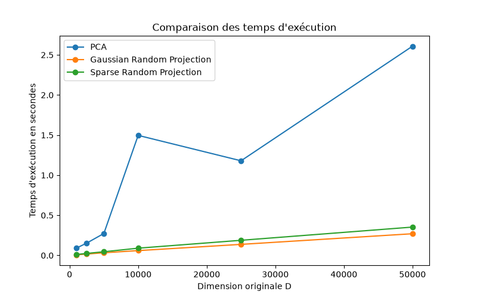

# Empirical validation of the Johnson-Lindenstrauss lemma on text data

## Introduction

I recently came across this fascinating lemma and decided to look further because of it's counter-intuitive nature.

This report presents an empirical evaluation of dimensionality reduction on high-dimensional text data (here, $N=1000$ documents from the `20newsgroups` dataset). By using `scikit-learn` library on Python, we investigate the tradeoff between distance distortion and target dimension $k$, alongside a computational performance comparison between PCA and common random projection techniques (Gaussian and Sparse).

---

## 1. Mathematical framework

The Johnson-Lindenstrauss lemma guarantees that a set of $N$ points in a high-dimensional space $\mathbb{R}^D$ can be mapped into a much lower-dimensional space $\mathbb{R}^k$ while preserving pairwise euclidean distances up to a factor of $(1 \pm \epsilon)$.

For any $\epsilon \in (0, 1)$ and integer $N$, if the target dimension $k$ satisfies:

$$k \ge \frac{8 \ln(N)}{\epsilon^2}$$

then there exists a linear map $f: \mathbb{R}^D \to \mathbb{R}^k$ such that for all $u, v \in X$:

$$(1 - \epsilon) \Vert{}u - v\Vert{}^2 \le \Vert{}f(u) - f(v)\Vert{}^2 \le (1 + \epsilon) \Vert{}u - v\Vert{}^2$$

In theoretical literature, this bound is often stated using asymptotic notations. 
- The upper bound $O(\log(N)/\epsilon^2)$ proves that a target dimension of this size is always sufficient to preserve distances ([Johnson & Lindenstrauss, 1984](#ref-jl84)). 
- The lower bound $\Omega(\log(N)/\epsilon^2)$ proves that no algorithm can ever compress data into fewer dimensions without exceeding $\epsilon$ ([Larsen & Nelson, 2017](#ref-ln17); [Alon, 2003](#ref-alon03)). 

Together these results demonstrate that this bound is strictly optimal. We will omit the proofs here for brevity.

*With the mathematical foundations established, let's now evaluate these properties on real data.*

---

## 2. Experimental setup

We will evaluate two primary aspects:

- **Experience 1 :** Distance distortion $\epsilon$ across target dimensions $k \in \{10, 20, 50, 100, 250, 500, 1000, 2000, 4000, 8000\}$.
- **Experience 2 :** Execution times across varying vocabulary sizes $D \in \{1000, 2500, 5000, 10000, 25000, 50000\}$ with $k=100$.

Dataset: 20newsgroups (vectorized with TfidfVectorizer)
Sample size $N$: 1,000 documents
Metrics: 95th percentile relative distance error and execution time (seconds)

---

## 3. Results and discussion

### Experiment 1:

The distance error is calculated as the relative difference between pairwise euclidean distances in the projected space vs the original TF-IDF space:

$$\text{Error}_{i,j} = \left\vert{} \frac{\Vert{}f(x_i) - f(x_j)\Vert{}}{\Vert{}x_i - x_j\Vert{}} - 1 \right\vert{}$$

and : $$\quad k \ge \frac{8 \ln(N)}{\epsilon_{\text{theoretical}}^2}$$

$$\epsilon_{\text{theoretical}}^2 \ge \frac{8 \ln(N)}{k}$$

$$\epsilon_{\text{theoretical}} \ge \sqrt{\frac{8 \ln(N)}{k}}$$

$$\epsilon_{\text{theoretical}} \ge \underbrace{\sqrt{8 \ln(N)}}_{\text{constant since } N \text{ is fixed }} \cdot \frac{1}{\sqrt{k}}$$

$$\epsilon_{\text{theoretical}}(k) = O\left(\frac{1}{\sqrt{k}}\right)$$

| $k$ | $\epsilon_{\text{mesured}}$ | $\epsilon_{\text{theoretical}}$ |
| --- | --- | --- |
| **10** | 0.4332 | 2.3508 |
| **20** | 0.3113 | 1.6623 |
| **50** | 0.1971 | 1.0513 |
| **100** | 0.1366 | 0.7434 |
| **250** | 0.0866 | 0.4702 |
| **500** | 0.0604 | 0.3325 |
| **1,000** | 0.0438 | 0.2351 |
| **2,000** | 0.0312 | 0.1662 |
| **4,000** | 0.0219 | 0.1175 |
| **8,000** | 0.0156 | 0.0831 |

The results validate the theoretical foundation of the JL lemma. Across all target dimensions $k$ (log scaled for better visualisation), the empirical distortion strictly follows the $O(1/\sqrt{k})$ asymptotic decay curve while staying consistently under the theoretical upper bound. 
Scikit-learn's `johnson_lindenstrauss_min_dim` function calculates a pessimistic worst-case limit. On the `20newsgroups dataset`, the projection works much better than this worst-case prediction and we reach $\epsilon \le 0.10$ at just $k \approx 250$, whereas the theoretical formula strictly requires $k = 5\,920$ for $N = 1\,000$.

---

### Experiment 2:

| Original dimension $D$ | PCA time (s) | Gaussian RP time (s) | Sparse RP time (s) |
| :--- | :--- | :--- | :--- |
| **1,000** | 0.1506 | 0.0090 | 0.0219 |
| **2,500** | 0.2350 | 0.0222 | 0.0328 |
| **5,000** | 0.2971 | 0.0321 | 0.0533 |
| **10,000** | 0.5911 | 0.0839 | 0.1384 |
| **25,000** | 1.9251 | 0.1570 | 0.2263 |
| **50,000** | 4.0728 | 0.3896 | 0.5412 |

A first run using `svd_solver='full'` produced non-monotonic computation spikes on the PCA execution curve.

Trying to find the problem causing this strange behavior, for small dimensions $D$, the matrix is small enough to fit easily into the processor's cache memory, keeping calculations fast. But once a certain size threshold is crossed ($D = 10\,000$ here), the matrix becomes too large to process efficiently. Apparently, LAPACK (the underlying C/Fortran linear algebra library used by SciPy and scikit-learn for exact matrix calculations) forces the sparse data into a huge dense matrix. This triggers a sudden RAM bottleneck and causes CPU slowdowns. Once past this threshold ($D \ge 25\,000$), the system's memory allocation is reorganized to stabilize the execution time.

Switching to `svd_solver='randomized'` ([Halko et al., 2011](#ref-halko2011)) smooths out the scaling trajectory, producing a predictable curve across all dimensions, though still remaining much slower than random projection.

Indeed, we observe that even with randomized approximations, PCA scaling remains heavily constrained by covariance matrix projections, reaching more than 4 seconds at $D = 50\,000$.
Both Gaussian and Sparse random projections execute approximately $10.5\times$ faster than PCA at $D = 50\,000$.
We can also see that Gaussian RP runs faster than Sparse RP.

---

## 4. Conclusion

1. The JL lemma holds on sparse TF-IDF text matrices with strong distance preservation. 
2. Random projections run way faster than PCA, with Gaussian RP slightly outperforming Sparse RP in execution time. 

--- 

## References

* Alon, N. (2003). Problems and results in extremal combinatorics. I. Discrete Mathematics, 273(1–3), 31–53. [[link](https://doi.org/10.1016/S0012-365X(03)00225-5)]
* Johnson, W. B., & Lindenstrauss, J. (1984). Extensions of Lipschitz mappings into a Hilbert space. Contemporary Mathematics, 26, 189–206. [[link](https://doi.org/10.1090/conm/026/737400)]
* Larsen, K. G., & Nelson, J. (2017). Optimality of the Johnson-Lindenstrauss Lemma. IEEE 58th Annual Symposium on Foundations of Computer Science (FOCS), 633–638. [[link](https://arxiv.org/abs/1609.02094)]
* Halko, N., Martinsson, P. G., & Tropp, J. A. (2011). Finding structure with randomness: Probabilistic algorithms for constructing approximate matrix decompositions. SIAM Review, 53(2), 217-288. [[link](https://arxiv.org/pdf/0909.4061.pdf)]